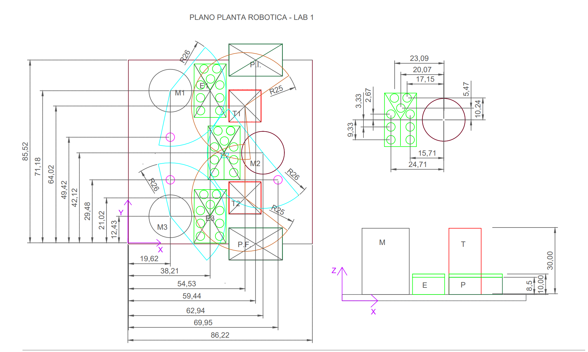
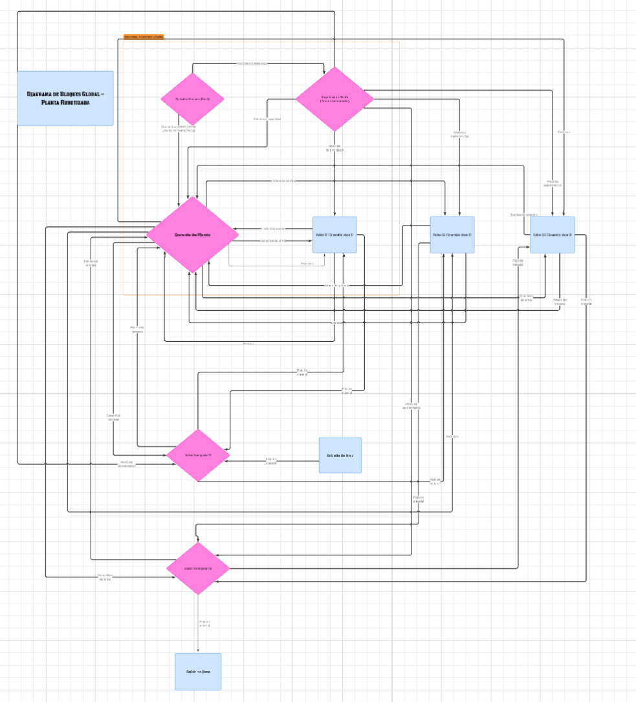

# 🏭 Proyecto: Diseño de una cadena de ensamblaje
**Universidad Militar Nueva Granada** | Facultad de Ingeniería Mecatrónica

## 🏗️ Descripción de la Planta
Este proyecto tiene como objetivo el diseño de una cadena de ensamble integrada por 6 robots (3 Ensambladores y 2 Transporatadores) a traves de la comunicacion entre ROS2.

* **Robots de Ensamble (3):** El robot manipulador es el encargado de agregar una pieza (PinPong) al ensamble general (caja), desde un almacen designado recoge la pieza y la transporta hasta la base de ensamble, cada base tiene un robot ensamblador
* **Robots de Transporte (2):** El robot manipulador es el encargado de llevar y transportar el ensamble general entre bases, entrada y salida, cada robot transportara hacia dos lugares.

---

## 🖥️ Diagrama de Bloques: General

La planta se opera con diferentes bloques comunicados entre ellos:
1. **Operador Humano:** Interfaz dedicada al control de inicio y final de la cadena como el monitoreo de lo que sucede.
2. **Seguridad de Planta:** Interfaz dedicada para protocolos de protección y alarmas.
3. **Gerente de Planta:** Algoritmo diseñado para la desicion de estados de la planta.
4. **Ensamnlador 1:**El robot ensamblador de la pieza 1 en base 1 
5. **Ensamnlador 2:**El robot ensamblador de la pieza 2 en base 2 
6. **Ensamnlador 3:**El robot ensamblador de la pieza 3 en base 3
7. **Transportador 1:**El robot transportador inicial recoge de la entrada, lo transporta a la base 1 y a la base 2
8. **Transportador 1:**El robot transportador final recoge de la base 2 lo lleva a la base 3 y lo deja en la salida
---

## 📁 Responsables 
Cada equipo es responsable de uno o mas bloques los cuales quedan estipulados a continuacion :

| Nombre | Rol Principal | Carpeta Asignada |
| :--- | :--- | :--- |
| [Nombre 1] | Gerente de Planta | `/GerenteDePlanta` |
| [Nombre 2] | Seguridad de Planta| `/SeguridadDePlanta` |
| [Nombre 2] | Operador Humano | `/SeguridadDePlanta` |
| [Nombre 2] | Ensamblador 1  | `/Ensamblador1` |
| [Nombre 2] | Ensamblador 2 | `/Ensamblador2` |
| [Nombre 2] | Ensamblador 3 | `/Ensamblador3` |
| [Nombre 2] | Ensamblador 1  | `/Ensamblador1` |
| [Nombre 2] | Transportador 1 | `/Transportador1` |
| [Nombre 2] | Transportador 2 | `/Transportador2` |